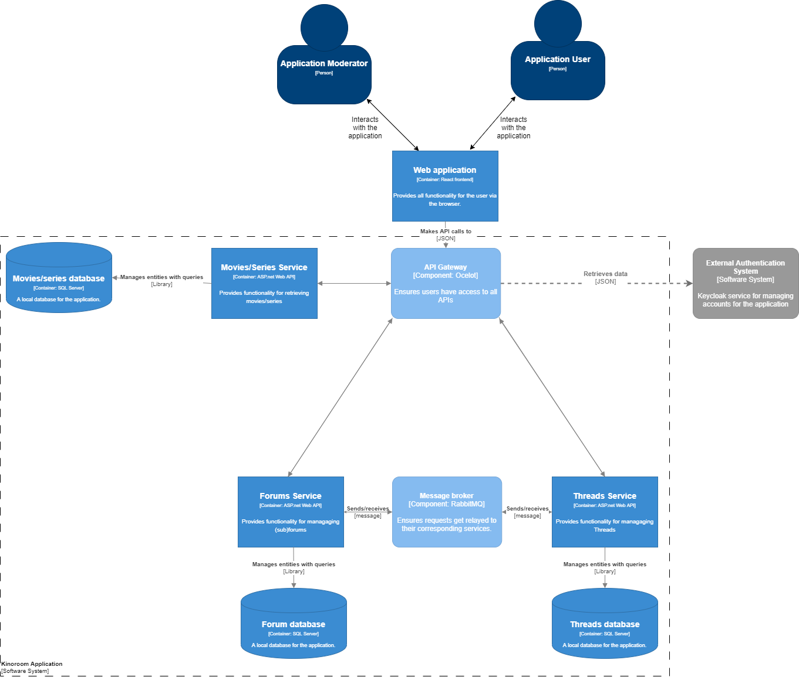
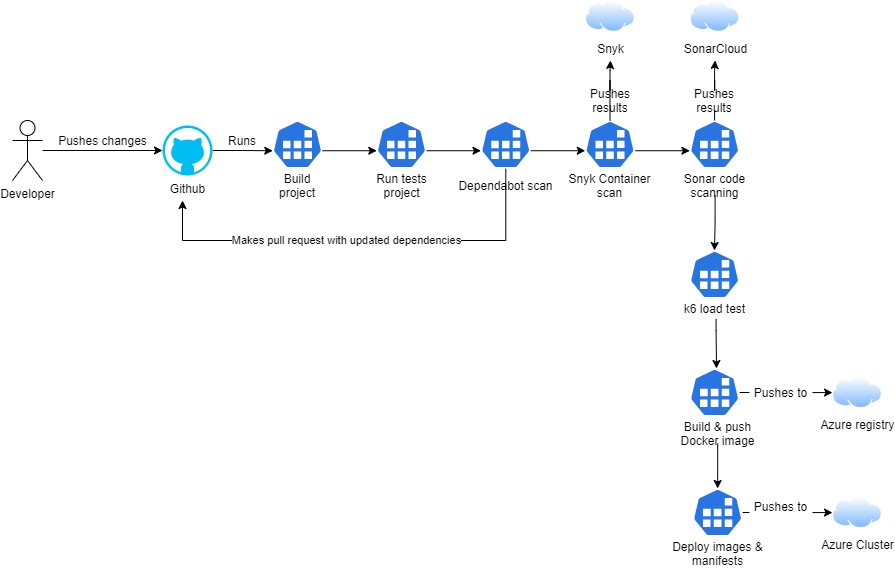

# Kinoroom Project
Repository containing all microservices + gateway I made for my 6th semester of Software Engineering of Fontys University of Applied Sciences. It's a simple application that allows users to create discussions (threads) in forums based on movies.

## Technologies used
- .NET Core 6 (C#)
- Docker
- Kubernetes
- Keycloak
- Github Actions
- Snyk Container
- Dependabot
- Sonarcloud
- Azure
- Ocelot (deprecated, replaced with KrakenD)
- KrakenD
- k6
- RabbitMQ
- Grafana
- InfluxDB
- MediatR (CQRS)
- MassTransit

## Software architecture


## CI/CD pipeline



## API Endpoints (from gateway)
SearchQuery has the following endpoints:
HTTP method | API endpoints             | Description
------------|---------------------------|---------------------------
 GET        | /api/v1/Movies            | Get all movies
 GET        | /api/v1/Movies/{id}       | Get movie by ID
 POST       | /api/v1/Movies            | Create movie
 PUT        | /api/v1/Movies            | Update movie
 DELETE     | /api/v1/Movies/{id}       | Delete movie
 GET        | /api/v1/Forums            | Get all forums
 GET        | /api/v1/Forums/{id}       | Get forum by ID
 POST       | /api/v1/Forums            | Create forum
 PUT        | /api/v1/Forums            | Update forum
 DELETE     | /api/v1/Forums/{id}       | Delete forum
 GET        | /api/v1/Threads           | Get all threads
 GET        | /api/v1/Threads/{id}      | Get thread by ID
 POST       | /api/v1/Threads           | Create thread
 PUT        | /api/v1/Threads/{id}      | Update thread
 DELETE     | /api/v1/Threads/{id}      | Delete thread

 ## Installation
First go through each respository referenced here and do
```bash
$ git clone https://github.com/IndividualProjectSemester6/{respository_name}:git
```
Then adjust all configurations regarding databases, Keycloak, and message brokers in the `appsetings.json` file of each microservice to your own set up. When all of this is done, build the Docker image from the root project files using
```bash
$ docker build -t {image_name}:latest .
```
then push them to your registry using
```bash
$ docker push {image_name}:latest
```
and reference them in `./manifests/deployment.yml` file for each microservice and gateway.

## Usage
For each service, go to `./manifests` and do
```bash
$ kubectl apply -f .
```
After each deployment has been made, you can first check if they are all running without errors with
```bash
$ kubectl get pods
```
If all of them have been built and deployed successfully, find the port of the gateway with
```bash
$ kubectl get svc api-gateway-service
```
Now you can make a request to `http://{your_ip}:{port}/api/v1/{service_name}/{endpoint}` to see the application in action!

## Contributing
Pull requests are not welcome. This project is finished.

## License
[MIT](https://choosealicense.com/licenses/mit/)
