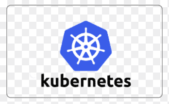

# KinoroomProject
Repository containing all microservices + gateway I made for my 6th semester of Software Engineering of Fontys University of Applied Sciences

## Technologies used
[

  <!-- You are encouraged to replace this logo with your own! Otherwise you can also remove it. -->
  
  
  
  
   ]